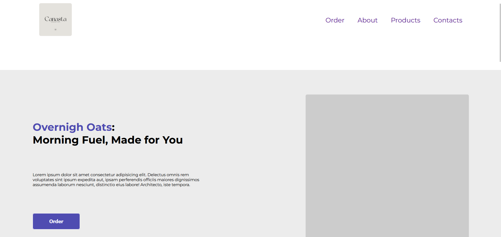

# Live Preview
- [live preview](https://azanra.github.io/personal-product-landing-page/)

# About 
This project focus on converting mockup design to
static website with react. The project focus on 
creating component that composed of another component 
with the help of modules with the goal of each component 
that can be reused throughout project.

# Review
Depending on the project size, maybe this component module
seems like overkill. But the goals of this project is to
create component that only composed of only one section of 
design. Also the use of css variable on this project maybe 
too much because all of them are declared on root, and some
of them only used once. and makes the css hard to understand.

# Screenshot
